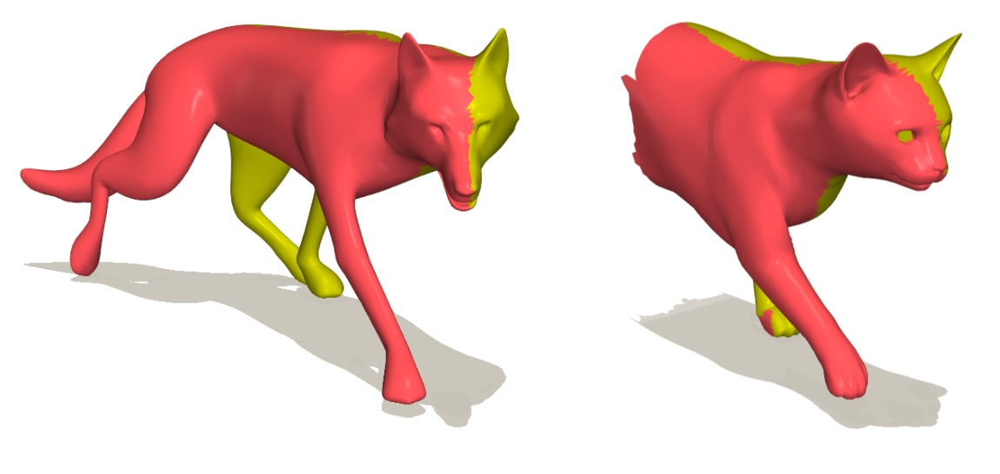
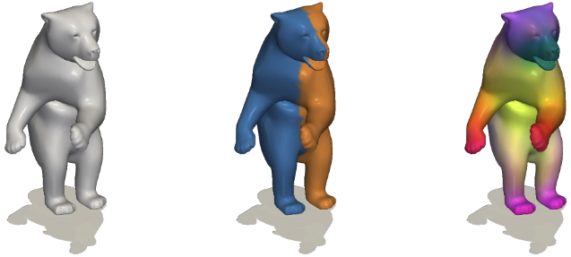

# SYMMETRY

This repository includes code for both "Chi: Symmetry Understanding of 3D Shapes via Chirality Disentanglement" and "Symmetry Informative and Agnostic Feature Disentanglement for 3D Shapes".

## Chi: Symmetry Understanding of 3D Shapes via Chirality Disentanglement [ICCV 2025]
<a href='https://wei-kang-wang.github.io/chirality/'></a>  [](https://arxiv.org/pdf/2508.05505)
<a href="https://pytorch.org/get-started/locally/"></a>


[Project Webpage](https://diff3f.github.io/) | [Paper](https://arxiv.org/pdf/2508.05505)

## Symmetry Informative and Agnostic Feature Disentanglement for 3D Shapes [3DV 2026]
-- More details coming soon --
<a href="https://pytorch.org/get-started/locally/"></a>



## Setup
```shell
conda create -n chi python=3.10
conda activate chi
conda install pytorch==2.1.2 torchvision==0.16.2 torchaudio==2.1.2 pytorch-cuda=11.8 -c pytorch -c nvidia
conda install -c fvcore -c iopath -c conda-forge fvcore iopath
conda install pytorch3d::pytorch3d meshplot
pip3 install ./third_party/ODISE 
pip3 install ./third_party/Mask2Former 
pip3 install diffusers==0.21.4 huggingface_hub==0.17.3 transformers==4.34.1 opencv-python==4.6.0.66 scikit-learn matplotlib numpy==1.25.0 plyfile trimesh potpourri3d robust-laplacian open3d accelerate==0.20.3 pillow==9.5.0 timm==0.6.11
```

## Data download & preparation:
Download [BECOS](https://github.com/NafieAmrani/becos-code) and generate the benchmark dataset.
Then precompute all necessary features using (for example).
```shell
./generate_images.py <dataset_name> <split> <idx>
./generate_features.py <dataset_name> <split> <idx>
```
For 3dv version only:
```shell
./generate_conjugate.py <dataset_name> <split> <idx>
```

## Usage
### Chi: Symmetry Understanding of 3D Shapes via Chirality Disentanglement [ICCV 2025]

Training a model from scratch (with testing):
```shell
CUBLAS_WORKSPACE_CONFIG=:16:8 python3 ./chi.py --train <data_folder> all --test <data_folder> all
```

Evaluating the provided model:
```shell
CUBLAS_WORKSPACE_CONFIG=:16:8 python3 ./chi.py --test <data_folder> all --pretrained ./pretrained/becos_full/
```


### Symmetry Informative and Agnostic Feature Disentanglement for 3D Shapes [3DV 2026]
Full code and details will be released soon

## BibTeX

```shell
@inproceedings{wang2025symmetry,
  title     = {Symmetry Understanding of 3D Shapes via Chirality Disentanglement},
  author    = {Weikang Wang, Tobias Weißberg, Nafie El Amrani and Florian Bernard},
  booktitle = {Proceedings of the IEEE/CVF International Conference on Computer Vision},
  year      = {2025}
}
```

```shell
@inproceedings{weissberg2025symmetry,
  title     = {Symmetry Informative and Agnostic Feature Disentanglement for 3D Shapes},
  author    = {Tobias Wei{\ss}berg, Weikang Wang, Paul Roetzer, Nafie El Amrani and Florian Bernard},
  booktitle = {International Conference on 3D Vision (3DV)},
  year      = {2026},
  note      = {to appear}
}
```


